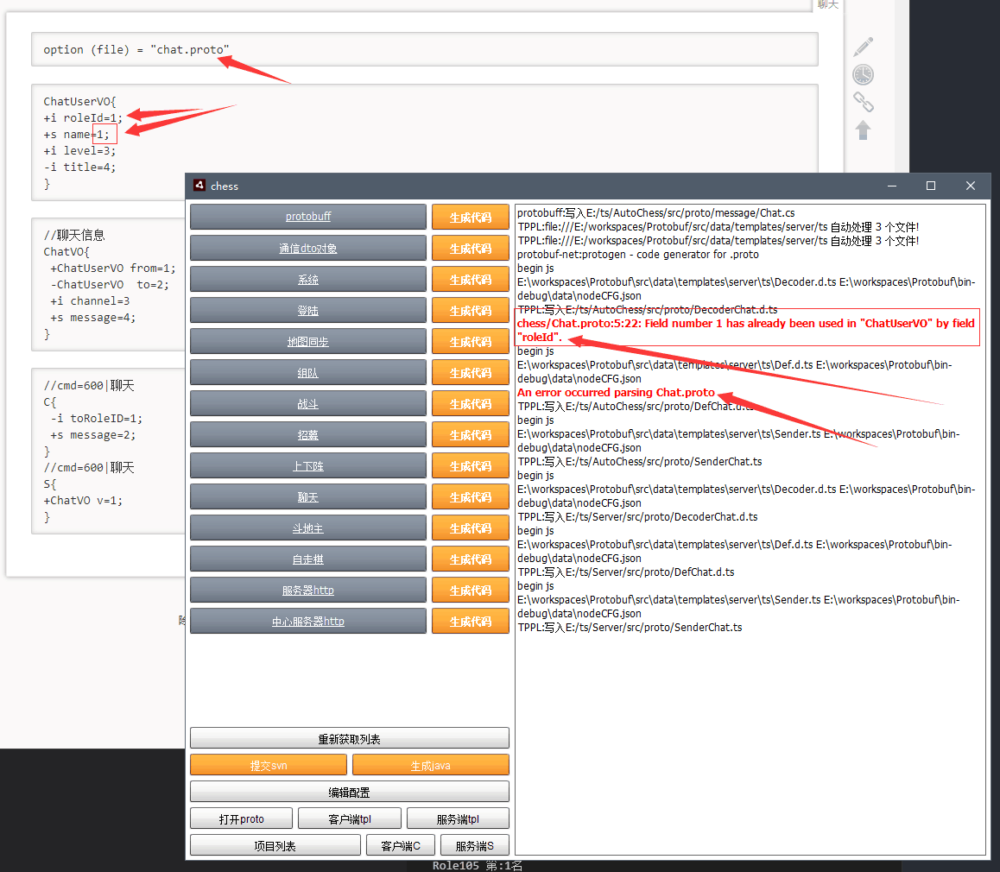

# protocolAMF

1. 对protobuff 中的tag= index<<3|wireType 添加一位数组的标记位
tag= index<<4|(label=="repeated")<<3|wireType
2. 如果标记位是数组,再writeU29 一个长度
3. 对于wireType的3位，可以有8种不同的基本类型,其实就足够了，所以直接分别写入类型就可以
4. 至此,接收方,可以不需要协议也可直接解开数据. (当然如果协议存在 就直接填充到协议中)

